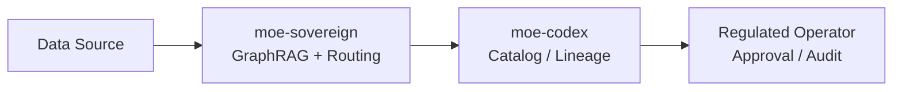

# <Use-Case-Name>

## Problem

> Describe the business or operational problem this use case solves. 2–4 sentences.
> Who is affected? What happens without this solution?

## Architecture



## Data Flow

| Step | Input | Transform | Output |
|------|-------|-----------|--------|
| 1    |       |           |        |
| 2    |       |           |        |

## Expert Routing

Describe which expert categories handle which sub-tasks and why.

## Example Prompts

```
# Prompt 1 — <intent>
<prompt text>
```

```
# Prompt 2 — <intent>
<prompt text>
```

## Prometheus KPIs

| Metric | Threshold | Alert |
|--------|-----------|-------|
| `moe_request_duration_seconds` | p95 < 5s | page oncall |

## Compliance Checklist

- [ ] GDPR Art. 5 (purpose limitation) verified
- [ ] AI Act risk class documented
- [ ] Audit trail enabled (Marquez lineage)
- [ ] Data retention policy configured
- [ ] Access control (OPA policy or Authentik group) in place
