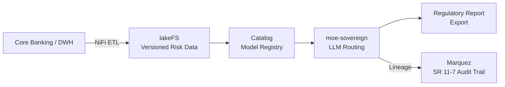

# Financial Risk & Regulatory Reporting Intelligence

## Problem

Banks face simultaneous regulatory pressures from EBA, ECB, BaFin, and DORA. Risk analysts spend months preparing SREP submissions and stress test reports from fragmented data warehouses. Model explainability requirements (ECB TRIM, SR 11-7) demand full audit trails for every model input and transformation.

MoE Codex provides a lineage-complete, versioned data intelligence platform where every risk model input is catalogued, approved, and traceable from raw source to regulatory output.

## Architecture

## Compliance Checklist

- [ ] DORA Art. 6: ICT risk management framework documented
- [ ] EBA Guidelines on ICT and Security Risk Management
- [ ] ECB TRIM / SR 11-7: full model lineage via Marquez mandatory
- [ ] BaFin BAIT: access logs and four-eyes principle via codex_approval
- [ ] NIS2 banking sector requirements
- [ ] No US-cloud processing of customer financial data (GDPR international transfer restrictions)
