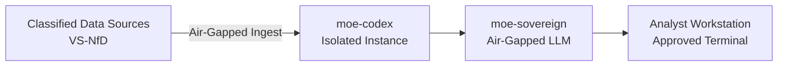

# Defence & Security Intelligence Analysis

## Problem

Defence ministries and security agencies require data intelligence platforms that meet VS-NfD (classified — For Official Use Only) classification requirements, full BSI IT-Grundschutz compliance, and can operate in completely air-gapped environments with no external network dependencies.

MoE Codex is a candidate foundation for such a platform. **This use case is experimental** — deployment requires customisation for classified network environments, dedicated legal review, and security accreditation by the responsible authority (BSI or equivalent).

> **Important:** AI systems used for real-time biometric identification, social scoring, or emotion recognition in law enforcement are classified as **unacceptable risk** under EU AI Act Art. 5 and must not be deployed with this stack without explicit legal basis and supervisory approval.

## Architecture

## Compliance Checklist

- [ ] BSI IT-Grundschutz: full module compliance required (dedicated assessment)
- [ ] VS-NfD classification handling: separate network segment mandatory
- [ ] AI Act Art. 5: verify no prohibited practices are enabled
- [ ] AI Act Annex III high/unacceptable risk: independent conformity assessment required
- [ ] Legal basis for automated analysis documented per §§ BKA-Gesetz / POG
- [ ] BVerfG Hessendata 2023: bulk analysis of citizens requires specific statutory basis
- [ ] No internet connectivity in deployment environment
