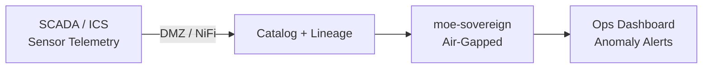

# Critical Energy Infrastructure Intelligence

## Problem

Energy grid operators (TSOs, DSOs) manage thousands of SCADA data points and must detect anomalies in near real-time while maintaining compliance with BDEW/VDE application rule and BSI ICS security requirements. Existing OT monitoring tools lack natural-language querying and cross-system correlation.

MoE Codex provides an IT/OT boundary-respecting intelligence layer: sensor telemetry is ingested via NiFi (OT-side), catalogued with strict access controls, and queryable by operations engineers — air-gapped from internet-facing systems.

## Architecture

## Compliance Checklist

- [ ] NIS2 energy sector requirements (high-impact entities)
- [ ] BSI IT-Grundschutz IND modules (IND.2.1, IND.2.3)
- [ ] BDEW/VDE application rule for OT security
- [ ] Strict IT/OT network segmentation — NiFi as DMZ bridge only
- [ ] No personal data in OT telemetry pipeline
