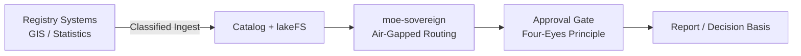

# Public Administration Data Platform

## Problem

Government agencies operate with strict data segregation requirements (Verschlusssachen, VS-NfD), inter-agency data silos, and legal mandates for full audit trails on any data access or automated decision. Existing cloud platforms fail sovereignty and BSI IT-Grundschutz requirements.

MoE Codex provides a BSI IT-Grundschutz-aligned, air-gappable data intelligence platform compliant with BVerfG data protection requirements (cf. Hessendata ruling 2023).

## Architecture

## Compliance Checklist

- [ ] BSI IT-Grundschutz Bausteine: APP.2.1, NET.1.1, NET.3.2
- [ ] Vier-Augen-Prinzip via codex_approval mandatory
- [ ] BDSG and DSGVO for personal data
- [ ] NIS2 public administration sector
- [ ] Air-gap deployment on BSI-approved infrastructure (e.g. Open Telekom Cloud, Delos)
- [ ] BVerfG Hessendata ruling 2023: no bulk automated analysis of citizens without legal basis
