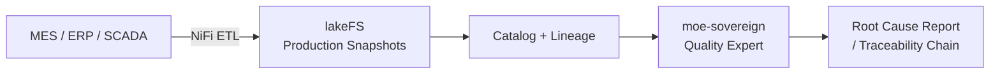

# Industrial Manufacturing Quality Intelligence

## Problem

Manufacturing plants generate enormous volumes of machine telemetry, quality control records, and supply chain events that are siloed across MES, ERP, and SCADA systems. Root-cause analysis for production failures takes days; traceability for product recalls (EU Product Safety Regulation) requires manual correlation across systems.

MoE Codex provides a unified, lineage-tracked manufacturing intelligence layer: production data flows from MES/ERP via NiFi, is versioned in lakeFS, and becomes queryable for quality teams without requiring SQL expertise.

## Architecture

## Compliance Checklist

- [ ] EU Product Safety Regulation: traceability chain via lakeFS + Marquez
- [ ] NIS2 manufacturing sector (where applicable)
- [ ] ISO 9001 / IATF 16949: audit trail for quality records
- [ ] No personal data in production telemetry pipeline
