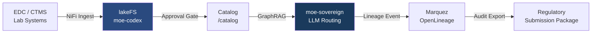

# Pharma Clinical Data Intelligence

## Problem

Pharmaceutical companies generate petabytes of clinical trial data across CROs, lab systems, and regulatory submissions. Analysts waste 60–80 % of their time finding, validating, and reconciling datasets before any analysis begins. Manual data lineage is incomplete, making regulatory audits (FDA 21 CFR Part 11, EMA Annex 11) expensive and error-prone.

MoE Codex provides a sovereign, air-gapped environment where clinical datasets are catalogued, versioned, and enriched with full OpenLineage provenance — so auditors can trace any data point back to its raw origin in one click.

## Architecture



## Data Flow

| Step | Input | Transform | Output |
|------|-------|-----------|--------|
| 1 | Raw EDC export (SAS7BDAT, CSV) | NiFi `ConvertRecord` → Parquet | lakeFS branch `raw/<trial-id>` |
| 2 | Parquet files | Approval gate: statistician review | lakeFS branch `approved/<trial-id>` |
| 3 | Approved dataset | Knowledge bundle import → Neo4j | GraphRAG-queryable ontology nodes |
| 4 | User query | moe-sovereign routing → medical_consult expert | Structured response + citations |
| 5 | Every query | Marquez lineage event emitted | Audit trail: query → dataset → raw source |

## Expert Routing

- **`medical_consult`** — primary expert for clinical interpretation, adverse event analysis, biomarker queries
- **`legal_advisor`** — secondary expert for regulatory language, submission text, SOP review
- **`data_analyst`** — tertiary expert for statistical summaries, outlier detection, cross-trial comparisons

The planner routes to `medical_consult` first; if the query contains "regulation", "submission", or "21 CFR", it escalates to `legal_advisor` as judge.

## Example Prompts

```
# Prompt 1 — Adverse Event Signal Detection
Analyse the Phase III trial dataset for TRIAL-2024-007. Identify any adverse event
patterns in the treatment arm with incidence > 5 % that were not observed in the
placebo arm. Cross-reference with the MedDRA PT codes in the catalogue.
```

```
# Prompt 2 — Regulatory Gap Analysis
Compare our current CRF data dictionary for Study XY-2024 against the FDA's
2023 Electronic Submissions guidance. List any required fields that are missing
or have inconsistent naming.
```

```
# Prompt 3 — Lineage Audit Query
Show the complete provenance chain for the primary endpoint dataset used in
the NDA submission for compound ABC-123. Include all transform steps and
approvals.
```

## Prometheus KPIs

| Metric | Threshold | Alert |
|--------|-----------|-------|
| `moe_request_duration_seconds{expert="medical_consult"}` | p95 < 8s | warn |
| `codex_approval_pending_count` | > 50 items | page |
| `codex_lineage_event_lag_seconds` | > 30s | warn |
| `moe_graphrag_query_hits` | < 0.6 hit rate | investigate |

## Compliance Checklist

- [ ] GDPR Art. 9 (special category — patient data): DPO sign-off before deployment
- [ ] DPIA completed (see `docs/system/dsgvo_dpia_template.md`)
- [ ] 21 CFR Part 11 audit trail: Marquez lineage covers electronic records requirement
- [ ] EMA Annex 11 validation: lakeFS commit hashes serve as audit-compliant version IDs
- [ ] AI Act Annex III risk class "high" (medical device context): human-in-the-loop approval gate mandatory
- [ ] All model outputs reviewed by qualified medical reviewer before regulatory use
- [ ] Data residency: deployment on EU infrastructure (Hetzner/OVH/STACKIT) mandatory
- [ ] NIS2 healthcare sector requirements: see `docs/system/nis2_readiness.md`
