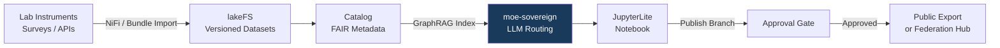

# Sovereign Research Data Platform

## Problem

University consortia and publicly funded research institutions face a conflict: EU open-science mandates (Horizon Europe) require FAIR data publication, while GDPR and project contracts restrict sharing of raw data. Existing platforms (Zenodo, OSF, GitHub) are US-hosted and lack fine-grained lineage, versioning, and access control for sensitive intermediate datasets.

MoE Codex provides a self-hosted FAIR data platform: datasets are catalogued and versioned with lakeFS, lineage is tracked via Marquez, and the approval gate controls which data can be published vs. kept internal — all without leaving EU infrastructure.

## Architecture



## Data Flow

| Step | Input | Transform | Output |
|------|-------|-----------|--------|
| 1 | Raw measurements / survey exports | NiFi validation → Parquet | lakeFS `raw/<project>/<run>` |
| 2 | Parquet datasets | Catalog annotation (FAIR metadata) | `/catalog` entries with DOI-ready metadata |
| 3 | Catalog entry | GraphRAG knowledge bundle import | Neo4j queryable research graph |
| 4 | Researcher query | moe-sovereign → research_assistant | Literature-grounded analysis |
| 5 | Analysis notebook | JupyterLite export → approval request | lakeFS PR `publish/<version>` |
| 6 | Approved version | moe-libris federation or static export | FAIR-compliant publication package |

## Expert Routing

- **`research_assistant`** — primary for literature synthesis, hypothesis generation, methodology review
- **`data_analyst`** — for statistical analysis, cross-dataset correlation, visualisation code
- Planner escalates to `data_analyst` when query contains numerical thresholds or statistical terms

## Example Prompts

```
# Prompt 1 — Literature-Grounded Synthesis
Synthesise findings from the genomic datasets in project GENOME-EU-2024 with
the existing literature on BRCA1 methylation patterns. Highlight where our
preliminary results confirm or diverge from published meta-analyses.
```

```
# Prompt 2 — FAIR Metadata Generation
Generate FAIR-compliant DataCite metadata for dataset version lakeFS:
phenotype-cohort/v2.3. Include recommended keywords from the MeSH ontology
and suggest a CC-BY 4.0 license statement.
```

```
# Prompt 3 — Reproducibility Check
Compare the analysis pipeline in notebook run 2024-11-15 with run 2024-12-03.
Identify any differences in preprocessing steps or parameter choices that could
explain the 12 % divergence in the final F1 score.
```

## Prometheus KPIs

| Metric | Threshold | Alert |
|--------|-----------|-------|
| `moe_request_duration_seconds{expert="research_assistant"}` | p95 < 10s | warn |
| `codex_versioning_commits_total` | monitor growth | track |
| `moe_graphrag_query_hits` | < 0.55 hit rate | investigate |

## Compliance Checklist

- [ ] GDPR Art. 5: purpose limitation documented per project in catalog metadata
- [ ] For human-subjects data: DPIA template completed (`docs/system/dsgvo_dpia_template.md`)
- [ ] Horizon Europe data management plan (DMP): lakeFS versioning covers FAIR requirement R1.2
- [ ] Pseudonymisation applied before ingest for any personal data
- [ ] Data residency: EU infrastructure confirmed (required for publicly-funded EU research)
- [ ] Publication export reviewed: no personal data in approved/public branch
